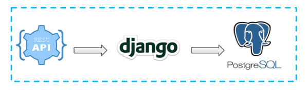

# Price Converter API
Repository for Django and Rest Framework api to Create, Read, Update and Delete products
from a database. 
It uses Django version 4.1 and Rest Framework version 3.13.1. PostgresSQL (CHECAR ESSA INFORMÇÃO) 
is set as database.

# Project Structure
```
├── converter_app/
│     - Django manager
│   ├── converter/
│        └── migrations/
│     -  Django main files (admin, apps, models, views, serializers) 
│   ├── converter_app/
│     - Django settings files
│   └── tests/
│     - Unit and Integrations tests 
├── requirements/ (ESSA PASTA PODE SUMIR)
│  ( COLOCAR COISAS DO DOCKER AQUI TALVEZ)
└--- README.md
```

## Methods
API requests must follow the schema:

| Method  | Description                               |
|----------|------------------------------------------|
| `GET`    | Returns prices for one or more products. |
| `POST`   | Create a new product.                    |
| `PUT`    | Update prices for a given product.       |
| `DELETE` | Remove a product from the system.        |

## Responses

| Status Code | Description                                                       |
|-------------|-------------------------------------------------------------------|
| `200`       | Request executed successfully.                                    |
| `201`       | Product was created.                                              |
| `204`       | No content returned.                                              |
| `400`       | Validation errors or the fields entered do not exist in database. |                                                        |
| `404`       | Searched product not found.                                       |

# Development Overview
The default development is used to proces requests.



# Running
In order to use the API, first one needs initiate all containers with docker-compose:
```
docker-compose up -d
```
After that it is necessary create migrates in the database, for that open a bash 
instance on your container calling ./bash.sh on the root of this project.
```
docker-compose run web_app bash
cd converter_app
python manage.py makemigrations 
python manage.py migrate
```
For use Django admin dependencies one needs register a user, still at the bash instance,
run the createsuperuser and provide a username, email and password.
```
python manage.py createsuperuser
```
Docker file contain the application and all container dependencies is already called docker-compose.yml.
Once application is up, one can use the url (local and in production) to use API.

Example to get all products
```
localhost:8000/products
```

Example to create one product:
+ Payload example for request (application/json)
```  
{
    "name": "Tenis nike",
    "prices": [
        {
            "slug_code": "BRL",
            "value": "529.99",
            "currency_country": "Brazil"
        },
        {
            "slug_code": "USD",
            "value": "98.23",
            "currency_country": "United States"
        },
        {
            "slug_code": "EUR",
            "value": "83.26",
            "currency_country": "Countries European Union"
        },
        {
            "slug_code": "INR",
            "value": "7318.93",
            "currency_country": "India"
        }
    ]
}
```

# Tests
To run a tests, first open the app directory as is shown below: 
```
cd converter_app
poetry run pytest tests/test_api.py
```
Run all tests
```
cd converter_app
poetry run pytest tests/
```

# Linter and Formatter
To use flake8 and black in files, for instance for all tests, one can hit the command: 
```
cd converter_app
poetry run flake8 tests/
poetry run black tests/
```